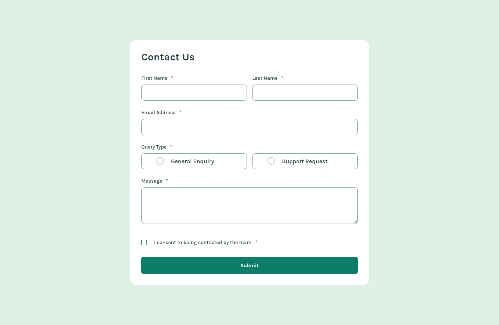
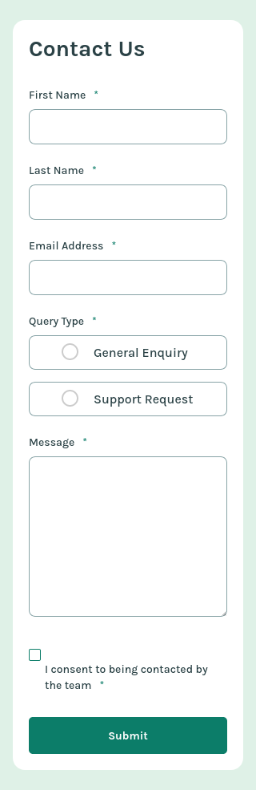

# Frontend Mentor - Solución de formulario de contacto

Esta es una solución al [desafío de formulario de contacto en Frontend Mentor](https://www.frontendmentor.io/challenges/contact-form--G-hYlqKJj). Los desafíos de Frontend Mentor te ayudan a mejorar tus habilidades de codificación mediante la creación de proyectos realistas.

## Índice

- [Frontend Mentor - Solución de formulario de contacto](#frontend-mentor---solución-de-formulario-de-contacto)
  - [Índice](#índice)
  - [Descripción general](#descripción-general)
    - [El desafío](#el-desafío)
    - [Captura de pantalla](#captura-de-pantalla)
      - [Diseño Desktop](#diseño-desktop)
      - [Diseño Mobile](#diseño-mobile)
    - [Enlaces](#enlaces)
  - [Mi proceso](#mi-proceso)
    - [Creado con](#creado-con)
  - [Autor](#autor)

## Descripción general

### El desafío

Los usuarios deberían poder:

- Completar el formulario y ver un mensaje de confirmación de que se envió correctamente
- Recibir mensajes de validación del formulario si:
- Se omitió un campo obligatorio
- La dirección de correo electrónico no es formateado correctamente
- Completar el formulario solo con el teclado
- Recibir mensajes de error, entradas y mensajes de éxito anunciados en el lector de pantalla
- Ver el diseño óptimo para la interfaz según el tamaño de la pantalla del dispositivo
- Ver los estados de desplazamiento y enfoque de todos los elementos interactivos de la página

### Captura de pantalla

#### Diseño Desktop

#### Diseño Mobile

### Enlaces

- URL de la solución: [github](https://github.com/jean266/formulario_001.git)
- URL del sitio en vivo: [Vercel]()

## Mi proceso

### Creado con

- Marcado HTML5 semántico
- Flexbox
- Cuadrícula CSS
- Flujo de trabajo para dispositivos móviles
- Gulp
- SASS

## Autor

- Mentor de frontend: [@jean266](https://www.frontendmentor.io/profile/jean266)

